# Writeup машины Soccer
Александр Смирнов, Сармат Скаев, Максим Тыван

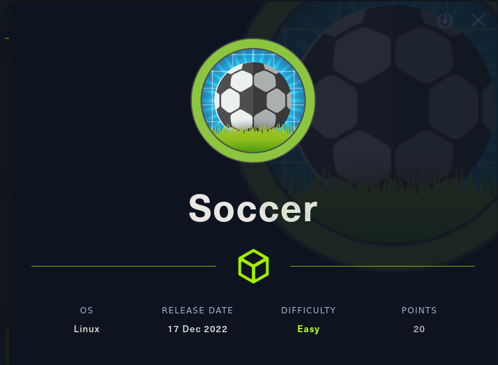

## Ход работы

### Сканирование хоста NMap

``` bash
┌──(kali㉿kali)-[~]
└─$ nmap -sC -sV 10.10.11.194

Starting Nmap 7.93 ( https://nmap.org ) at 2023-04-17 12:25 EDT
Nmap scan report for soccer.htb (10.10.11.194)
Host is up (0.053s latency).
Not shown: 997 closed tcp ports (conn-refused)
PORT     STATE SERVICE         VERSION
22/tcp   open  ssh             OpenSSH 8.2p1 Ubuntu 4ubuntu0.5 (Ubuntu Linux; protocol 2.0)
| ssh-hostkey: 
|   3072 ad0d84a3fdcc98a478fef94915dae16d (RSA)
|   256 dfd6a39f68269dfc7c6a0c29e961f00c (ECDSA)
|_  256 5797565def793c2fcbdb35fff17c615c (ED25519)
80/tcp   open  http            nginx 1.18.0 (Ubuntu)
|_http-server-header: nginx/1.18.0 (Ubuntu)
|_http-title: Soccer - Index 
9091/tcp open  xmltec-xmlmail?
| fingerprint-strings: 
|   DNSStatusRequestTCP, DNSVersionBindReqTCP, Help, RPCCheck, SSLSessionReq, drda, informix: 
|     HTTP/1.1 400 Bad Request
|     Connection: close
|   GetRequest: 
|     HTTP/1.1 404 Not Found
|     Content-Security-Policy: default-src 'none'
|     X-Content-Type-Options: nosniff
|     Content-Type: text/html; charset=utf-8
|     Content-Length: 139
|     Date: Mon, 17 Apr 2023 16:25:26 GMT
|     Connection: close
|     <!DOCTYPE html>
|     <html lang="en">
|     <head>
|     <meta charset="utf-8">
|     <title>Error</title>
|     </head>
|     <body>
|     <pre>Cannot GET /</pre>
|     </body>
|     </html>
|   HTTPOptions, RTSPRequest: 
|     HTTP/1.1 404 Not Found
|     Content-Security-Policy: default-src 'none'
|     X-Content-Type-Options: nosniff
|     Content-Type: text/html; charset=utf-8
|     Content-Length: 143
|     Date: Mon, 17 Apr 2023 16:25:26 GMT
|     Connection: close
|     <!DOCTYPE html>
|     <html lang="en">
|     <head>
|     <meta charset="utf-8">
|     <title>Error</title>
|     </head>
|     <body>
|     <pre>Cannot OPTIONS /</pre>
|     </body>
|_    </html>
1 service unrecognized despite returning data. If you know the service/version, please submit the following fingerprint at https://nmap.org/cgi-bin/submit.cgi?new-service :
SF-Port9091-TCP:V=7.93%I=7%D=4/17%Time=643D72F1%P=x86_64-pc-linux-gnu%r(in
SF:formix,2F,"HTTP/1\.1\x20400\x20Bad\x20Request\r\nConnection:\x20close\r
SF:\n\r\n")%r(drda,2F,"HTTP/1\.1\x20400\x20Bad\x20Request\r\nConnection:\x
SF:20close\r\n\r\n")%r(GetRequest,168,"HTTP/1\.1\x20404\x20Not\x20Found\r\
SF:nContent-Security-Policy:\x20default-src\x20'none'\r\nX-Content-Type-Op
SF:tions:\x20nosniff\r\nContent-Type:\x20text/html;\x20charset=utf-8\r\nCo
SF:ntent-Length:\x20139\r\nDate:\x20Mon,\x2017\x20Apr\x202023\x2016:25:26\
SF:x20GMT\r\nConnection:\x20close\r\n\r\n<!DOCTYPE\x20html>\n<html\x20lang
SF:=\"en\">\n<head>\n<meta\x20charset=\"utf-8\">\n<title>Error</title>\n</
SF:head>\n<body>\n<pre>Cannot\x20GET\x20/</pre>\n</body>\n</html>\n")%r(HT
SF:TPOptions,16C,"HTTP/1\.1\x20404\x20Not\x20Found\r\nContent-Security-Pol
SF:icy:\x20default-src\x20'none'\r\nX-Content-Type-Options:\x20nosniff\r\n
SF:Content-Type:\x20text/html;\x20charset=utf-8\r\nContent-Length:\x20143\
SF:r\nDate:\x20Mon,\x2017\x20Apr\x202023\x2016:25:26\x20GMT\r\nConnection:
SF:\x20close\r\n\r\n<!DOCTYPE\x20html>\n<html\x20lang=\"en\">\n<head>\n<me
SF:ta\x20charset=\"utf-8\">\n<title>Error</title>\n</head>\n<body>\n<pre>C
SF:annot\x20OPTIONS\x20/</pre>\n</body>\n</html>\n")%r(RTSPRequest,16C,"HT
SF:TP/1\.1\x20404\x20Not\x20Found\r\nContent-Security-Policy:\x20default-s
SF:rc\x20'none'\r\nX-Content-Type-Options:\x20nosniff\r\nContent-Type:\x20
SF:text/html;\x20charset=utf-8\r\nContent-Length:\x20143\r\nDate:\x20Mon,\
SF:x2017\x20Apr\x202023\x2016:25:26\x20GMT\r\nConnection:\x20close\r\n\r\n
SF:<!DOCTYPE\x20html>\n<html\x20lang=\"en\">\n<head>\n<meta\x20charset=\"u
SF:tf-8\">\n<title>Error</title>\n</head>\n<body>\n<pre>Cannot\x20OPTIONS\
SF:x20/</pre>\n</body>\n</html>\n")%r(RPCCheck,2F,"HTTP/1\.1\x20400\x20Bad
SF:\x20Request\r\nConnection:\x20close\r\n\r\n")%r(DNSVersionBindReqTCP,2F
SF:,"HTTP/1\.1\x20400\x20Bad\x20Request\r\nConnection:\x20close\r\n\r\n")%
SF:r(DNSStatusRequestTCP,2F,"HTTP/1\.1\x20400\x20Bad\x20Request\r\nConnect
SF:ion:\x20close\r\n\r\n")%r(Help,2F,"HTTP/1\.1\x20400\x20Bad\x20Request\r
SF:\nConnection:\x20close\r\n\r\n")%r(SSLSessionReq,2F,"HTTP/1\.1\x20400\x
SF:20Bad\x20Request\r\nConnection:\x20close\r\n\r\n");
Service Info: OS: Linux; CPE: cpe:/o:linux:linux_kernel

Service detection performed. Please report any incorrect results at https://nmap.org/submit/ .
Nmap done: 1 IP address (1 host up) scanned in 17.63 seconds
```

На хосте имеется:

1.Веб-сервер Nginx

2.SSH-сервер

3.Неизвестный сервис на порту 9091

Добавим ресурсную запись хоста в файл /etc/hosts:

``` bash
┌──(kali㉿kali)-[~]
└─$ sudo echo 10.10.11.194 soccer.htb >> /etc/hosts
```

### Работа с веб-сервером

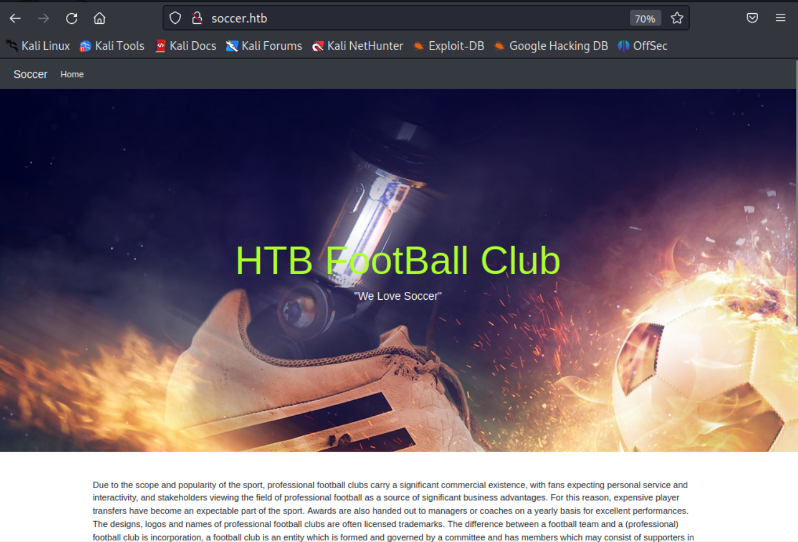

Имеется одностраничный сайт-визитка – ничего интересного даже в исходном
коде страницы.

Попробуем перебрать директории с помощью OWASP Dirbuster. Используется
словарь `/usr/share/dirbuster/wordlists/directory-list-2.3-medium.txt`:


Полученный отчёт:

    DirBuster 1.0-RC1 - Report
    http://www.owasp.org/index.php/Category:OWASP_DirBuster_Project
    Report produced on Mon Apr 17 12:37:03 EDT 2023
    --------------------------------

    http://soccer.htb:80
    --------------------------------
    Directories found during testing:

    Dirs found with a 200 response:

    /
    /tiny/

    Dirs found with a 403 response:

    /tiny/uploads/


    --------------------------------
    Files found during testing:

    Files found with a 301 responce:

    /tiny
    /tiny/uploads


    --------------------------------

Перейдём в директорию `http://soccer.htb/tiny/`:

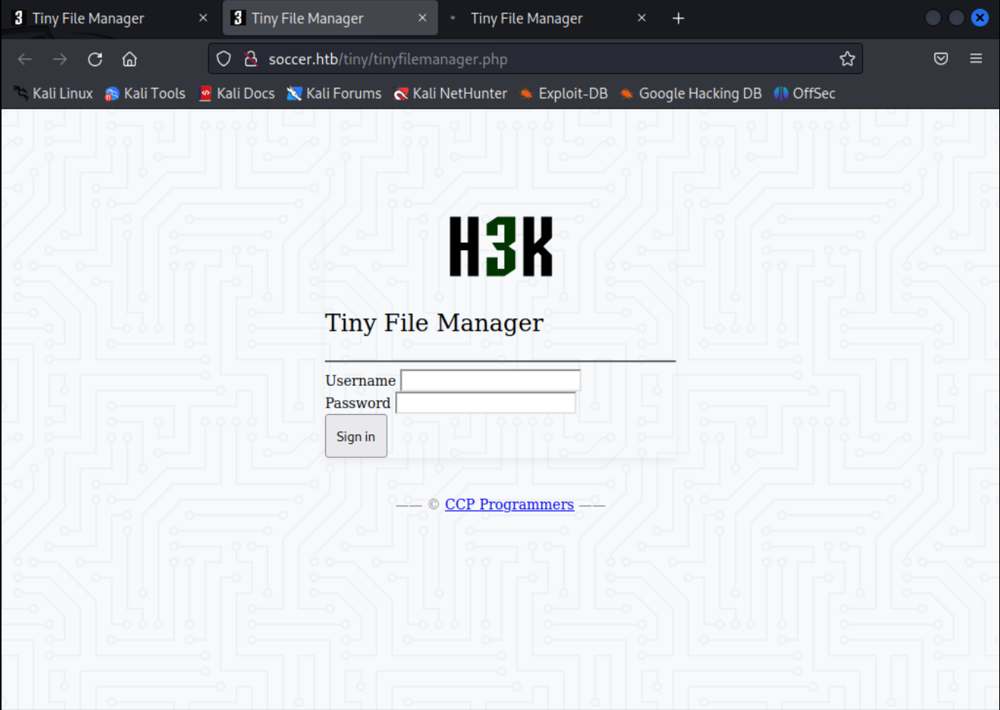

В данной директории находится файловый менеджер Tiny
(https://github.com/prasathmani/tinyfilemanager). Согласно документации,
стандартные имена и пароли:

-   admin/admin123

-   user/12345

Успешно получилось зайти с аккаунта admin:

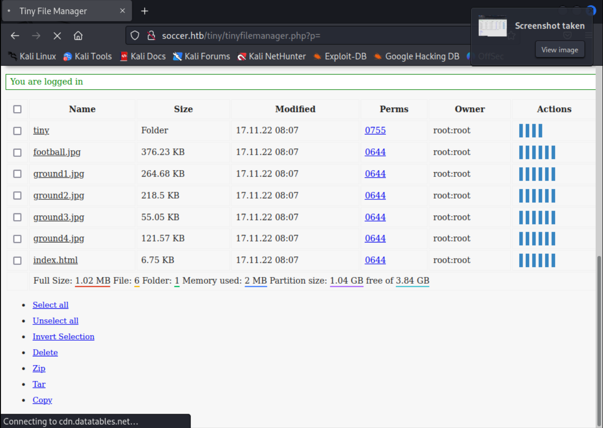

Поищем уязвимости в базе уязвимостей MITRE
(https://cve.mitre.org/cgi-bin/cvekey.cgi?keyword=Tiny+File+Manager).
Нас интересует RCE-уязвимость CVE-2021-45010, охватывающая множество
версий файлового менеджера. Проверим версию Tiny на машине:


Версия 2.4.3 имеет данную уязвимость. Попробуем её возобновить, залив на
сервер свой файл:

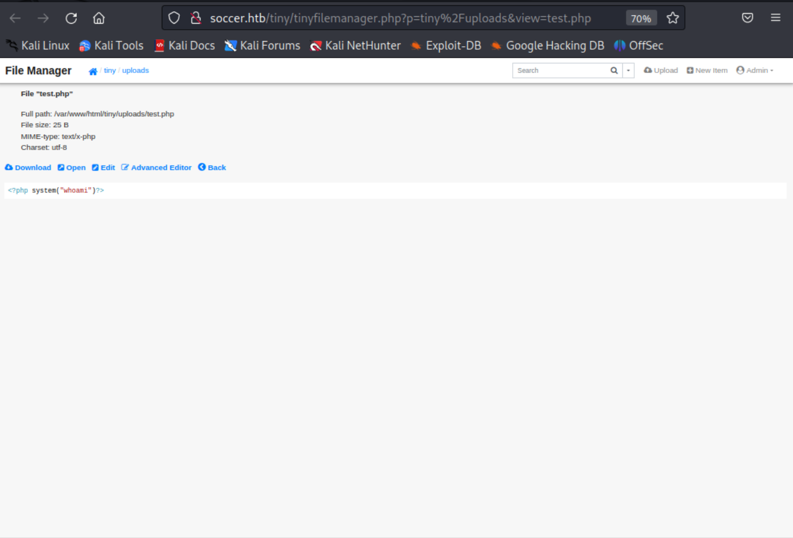

При открытии код действительно исполняется:


Воспользуемся Reverse Shell, написанным на PHP
(https://github.com/h4ckthreat/php-reverse-shell/blob/main/php-reverse-shell.php):

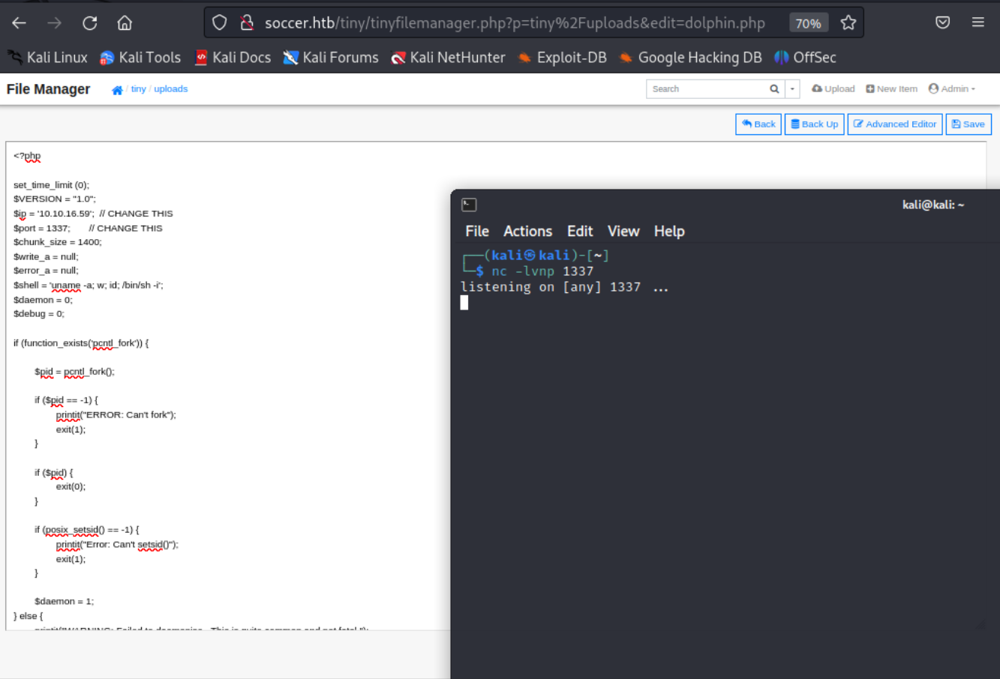

Загрузим файл на сервер и получим доступ к хосту от имени пользователя
www-data.


В файлах конфигурации Nginx фигурирует ещё один домен:
`soc-player.soccer.htb`

Добавим его в файл hosts:

``` bash
┌──(kali㉿kali)-[~]
└─$ sudo echo 10.10.11.194 soc-player.soccer.htb >> /etc/hosts
```

Зайдём на него:

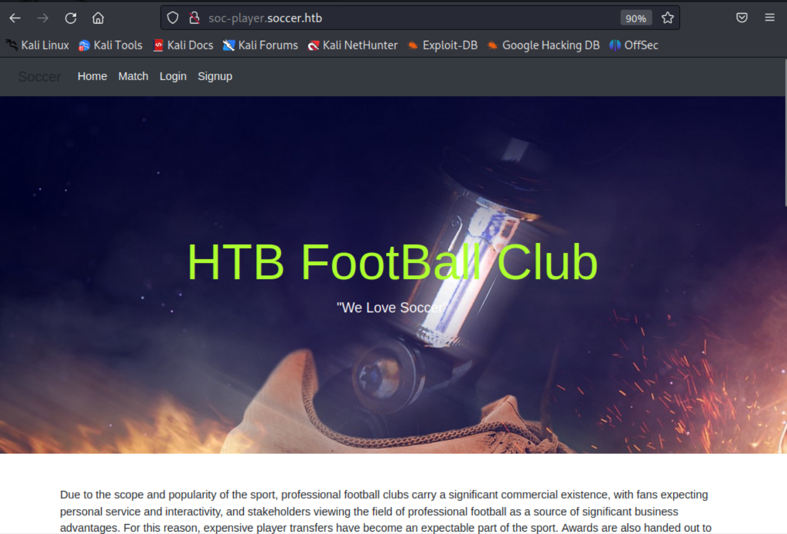


Данный сайт значительно уже более функционален, чем тот, что был
рассмотрен выше: присутствует форма авторизации и некая опция Match.

Авторизуемся на сайте:

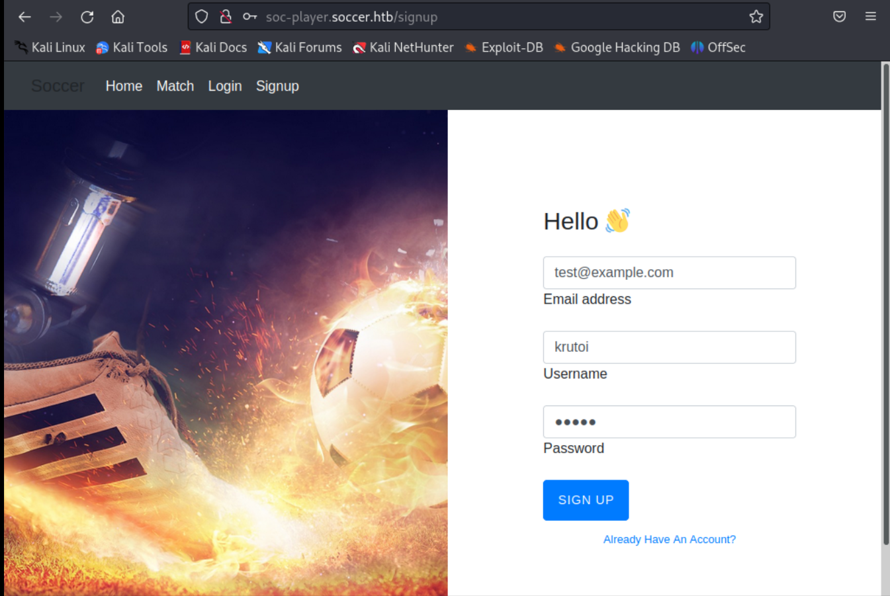

После авторизации пользователя встречает интерфейс, позволяющий
проверить, является ли билет действительным или нет:

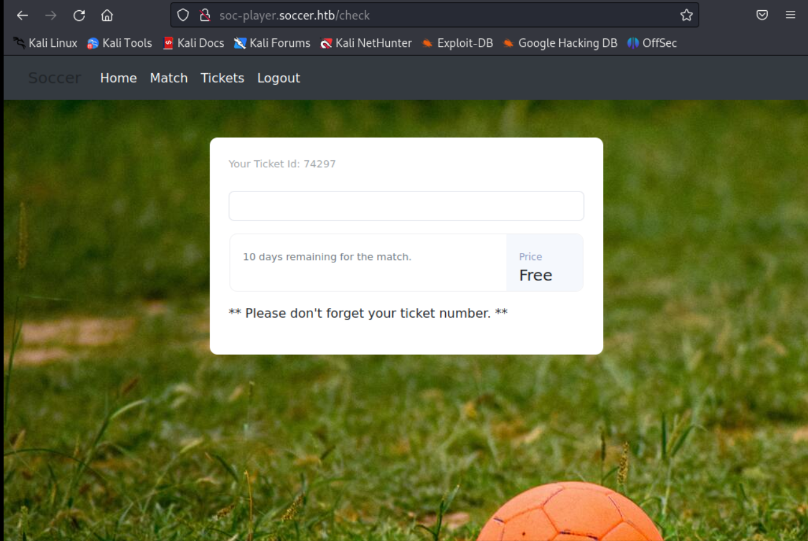

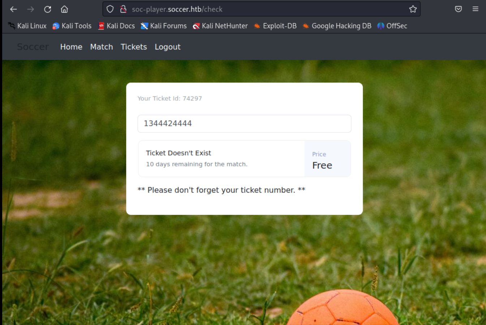

Посмотрим на исходный код сайта:

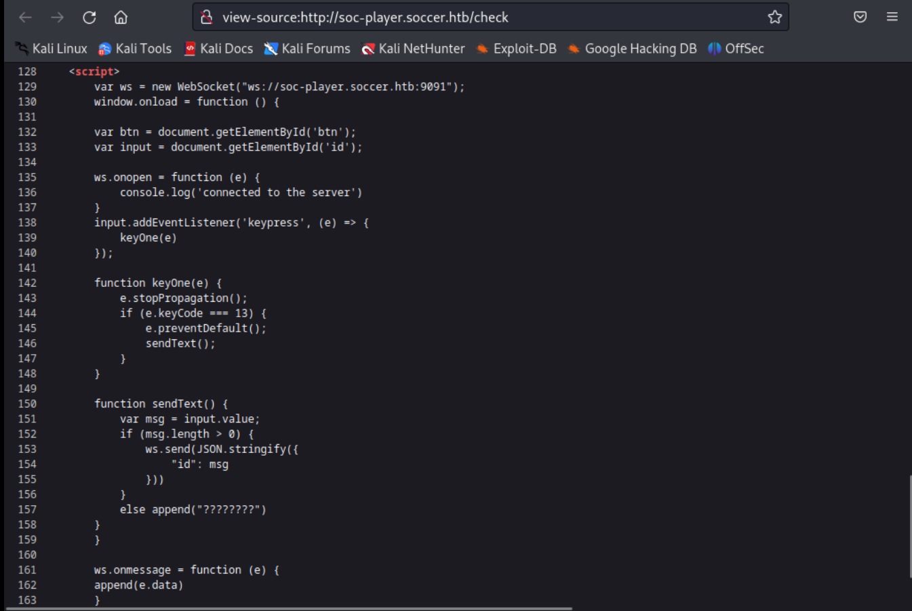

Скрипт подключается по WebSocket к порту 9091, принимает в поле ввода
значение, и с некоторой задержкой после ввода данных пользователем,
отправляет через WebSocket значение id. Попробуем проверить, уязвима ли
данная система к SQL-инъекциям:


### SQL-инъекции с использованием SQLMap

Для начала необходимо запустить промежуточное ПО, которое станет
прослойкой между запросами SQLMap и WebSockets
(https://rayhan0x01.github.io/ctf/2021/04/02/blind-sqli-over-websocket-automation.html,
middleware.py в репозитории):


Попробуем перебрать все базы данных, которые в СУБД:


Нас может заинтересовать база данных soccer_db. Получим её дамп:


Были получены логин и пароль:


#### Повышение привелегий

Попробуем по ним к серверу по ssh:

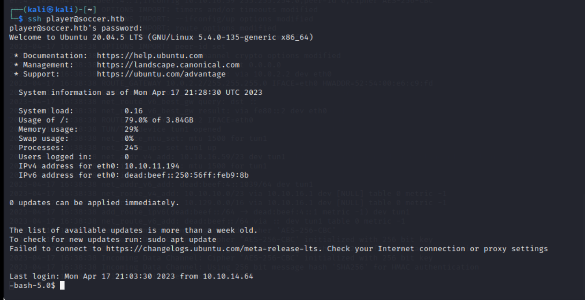

Получен пользовательский флаг: 

Зальём его на сайт:

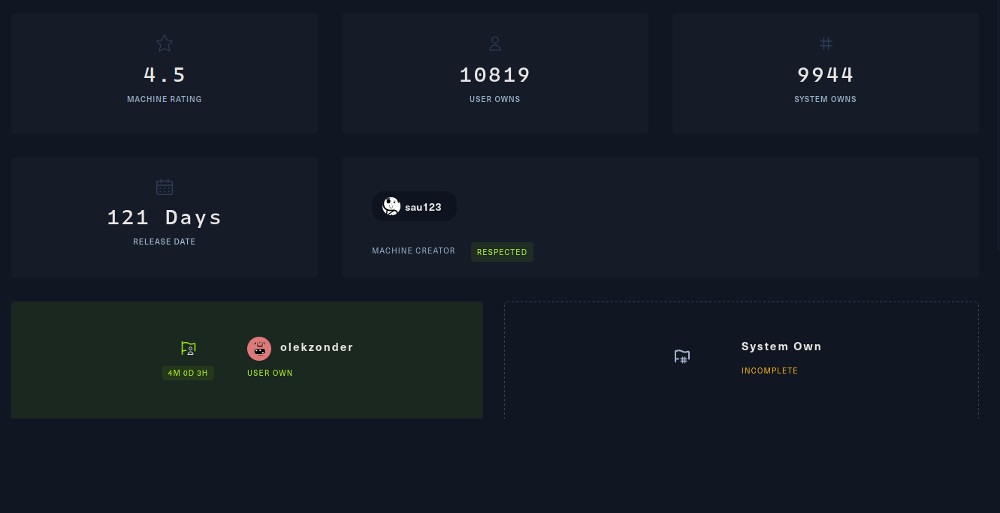

Пользователь не прописан в `/etc/sudoers`:


Проверим, какие программы есть с `SETUID` (флагом в UNIX, обозначающим,
что можно запустить исполняемый файл от имени владельца исполняемого
файла, например пользователя root):


Есть утилита `/usr/local/bin/doas`, являющаяся функциональным аналогом
sudo:


Проверим файл конфигурации `/usr/local/etc/doas.conf`:


Пользователь имеет право запускать утилиту
dstat(https://github.com/dstat-real/dstat) от имении суперпользователя:


Dstat поддерживает плагины, написанные на чистом Python. Напишем свой в
каталог `/usr/share/local/dstat`:


Плагин ставит флаг `SETUID` в файл `/bin/bash`. Это означает то, что,
запустив bash, он будет исполняться от имени суперпользователя.

Был получен полный доступ к машине:

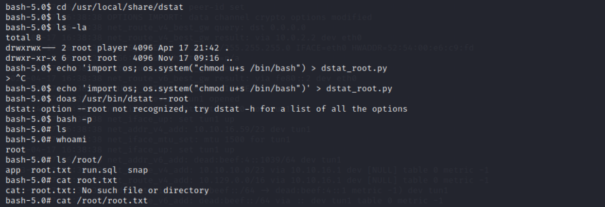

Выложим флаг:

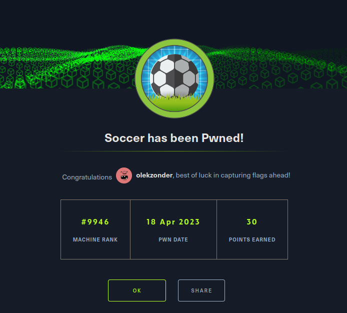

Машина взломана!
